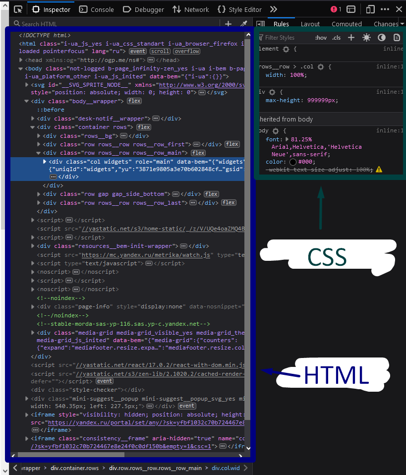
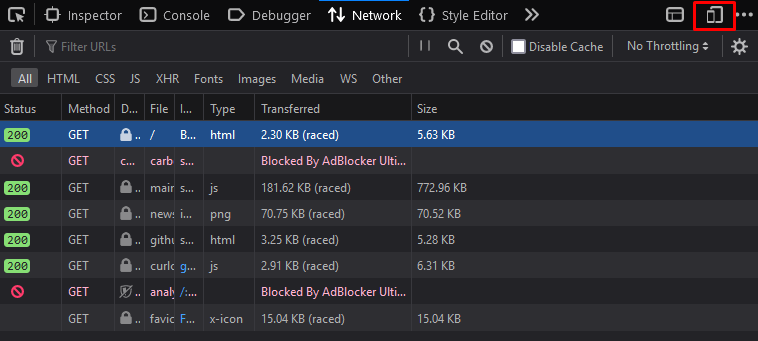
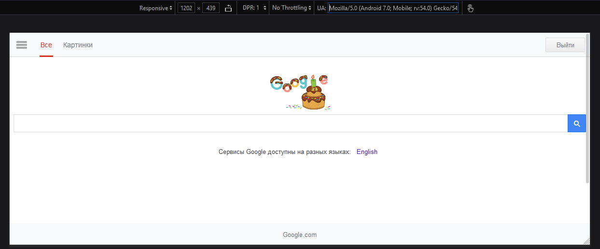
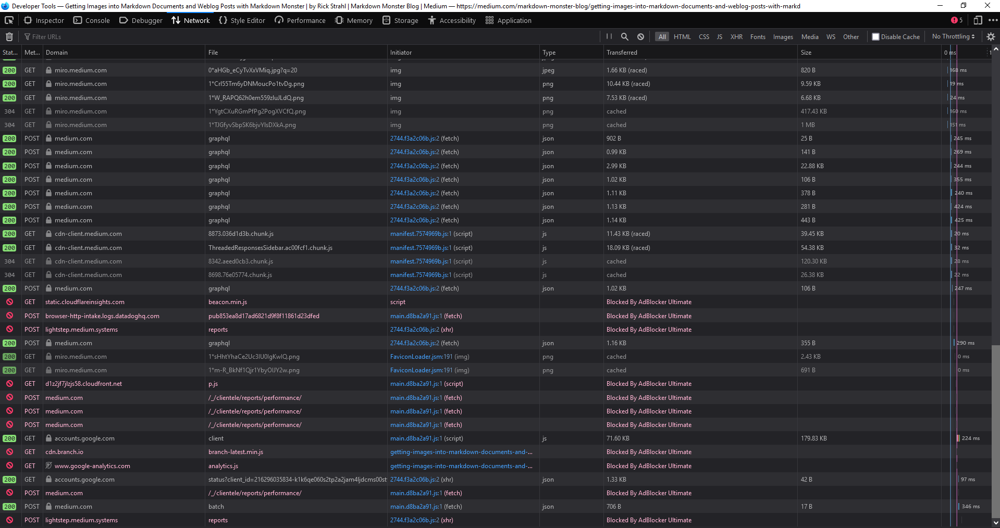
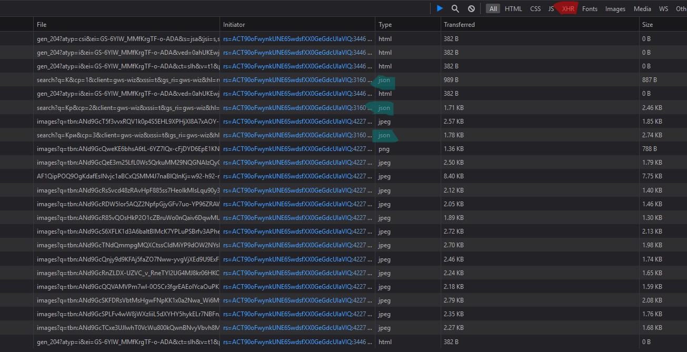
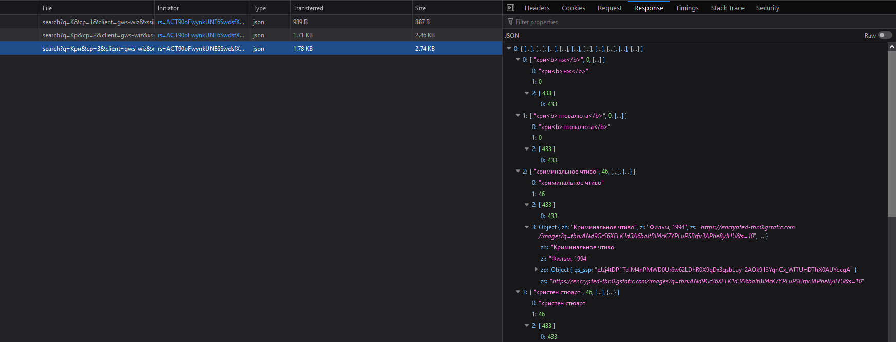
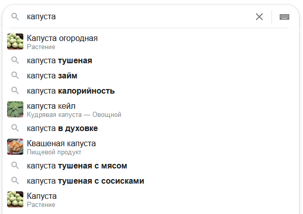
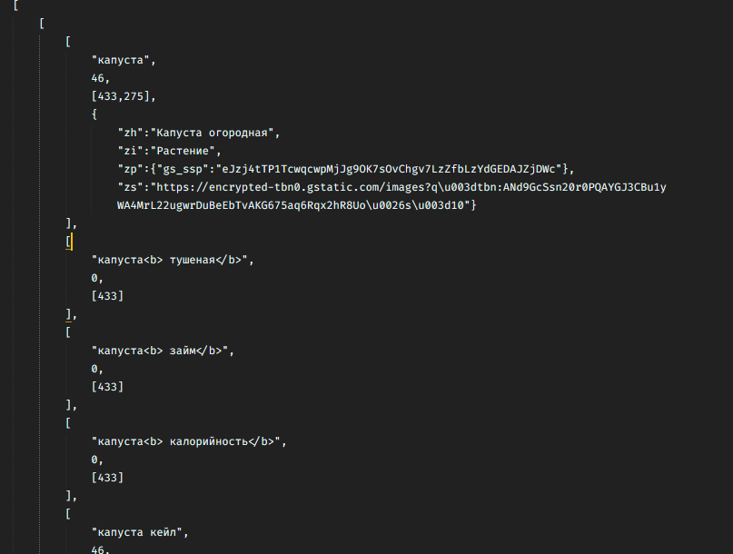

### Гайд по инструментам разработчика

В целом следующие горячие клавиши/названия +- совпадают во всех браузерах, посему надеюсь у вас не возникнет сложности с применением данных методов на своих браузерах.
*Ну а автор будет юзать [**Mozilla Firefox Developer Edition**](https://www.mozilla.org/ru/firefox/developer/) на Windows10*

---

### Панель инструментов разработчика

При нажатии клавиши `F12` У вас откроется ***Панель инструментов разработчика***. Также быстро его можно открыть нажав правой кнопкой мыши на странице, и выбрав пункт `Inspect Element`.



От себя предлагаю сразу перенастроить инструмент, чтобы он открывался в отдельном окне, а не в этом-же, чтобы было удобнее управляться с интерфейсом.

---

###  Просмотреть страницу как с телефона

Для открытия мобильной версии телефона воспользуйтесь кнопкой Responsive Design Mode (аналоги присутствуют и в других поппулярных браузерах)



В этом режиме вы можете ввести User-Agent, присущий мобильному браузеру (например `Mozilla/5.0 (Android 7.0; Mobile; rv:54.0) Gecko/54.0 Firefox/54.0`). Тогда страница будет отображаться как с телефона (+в некоторых кейсах будет изменяться ряд сервисов/ссылок, к которым посылается запрос)



---

### Панель сети

В этом окне, помимо *CSS* и *HTML* можно отслеживать `сеть (Network)` - чем мы будем пользоваться чаще всего. Именно в нём мы будем искать наличие *API*, важные ссылки и т.п. (нужно для первого метода парсинга через библиотеку requests)



В верхней части окна соответственно вы можете видеть:

- Очистка записей
- Фильтр URL по введённой подстроке
- Пауза/запуск логирования
- Поиск по логам
- Настройка блокировщика
- Фильтр файлов по типу (отображать лишь *HTML/CSS/...* )
- и т.п.

Самым важным для нас будут поиск по логам, фильтр URL по подстроке и фильтр файлов по типу.

---

# Пример поиска API

В ситуациях, когда вы замечаете, что некоторые данные на сайте подгружаются динамически, вы можете понять, что сервер и браузер связываются непосредственно в данный момент, а следовательно всё "общение" браузера и сервера могут быть найдены в панели `Network` в инструментах разработчика.

К примеру рассмотрим механизм автодополнения на сайте **Google.com**. Порядок действий в таком случае следующий:

- Зайдём на сайт **google.com**
- Запустим логирование соединений в инструмментах разработчика
- Начинаем вводить запрос
- Отслеживаем возникающие соединения на панели `Network` браузера с сервером

*Чаще всего важные текстовые данные передаются в форматах JSON. Вы либо можете их найти в колонке Type, либо изначально отфильтровать все файлы нажав кнопку `XHR` (XMLHttpRequest)*



Теперь поочерёдно нажимая по каждому из запросов в списке на панели `Response` мы можем отслеживать что было возвращено нам сервером. Нажав правой кнопкой мыши по конкретноу запросу его можно открыть в новой вкладке или же скопировать *URL*.



---
---
---

# Параметры в URL

*GET-параметры* в *URL* (посланные с целью получить информацию), разделяются посредством амперсанда `&`, а начинаются они после знака `?`
(Пример : https://www.google.com/complete/search?q=%D0%9A%D1%80%D0%B8&cp=3&client=gws-wiz&xssi=t&gs_ri=gws-wiz&hl=ru&authuser=0&psi=GS-6YIW_MMfKrgTF-o-ADA.1622814489988&dpr=1)

Например в данном *URL* были посланы соответственно следующие параметры:
```
- q = %D0%9A%D1%80%D0%B8
- cp = 3
- client = gws-wiz
- xssi = t
- gs_ri = gws-wiz
- hl=ru
- authuser = 0
- psi = GS-6YIW_MMfKrgTF-o-ADA.1622814489988
- dpr = 1
```

Наша основная задача в случае использования *API* - подделка запросов, чтобы сервер воспринимал их как свои и спокойно отвечал нам на запрос. Знать значение и назначение всех полей не всегда обязательно. В поле `q` вы можете наблюдать записанное в виде двух байтов в кодировке *UTF-8* слово "Кри", которое мы вводили ранне (проверить это можно [здесь](https://meyerweb.com/eric/tools/dencoder/)). В нашем случае достаточно будет заменить запрос в поле `q` (причём без обязательной записи в *UTF-8* коде), чтобы сервер вернул нам автодополнение на другое слово.

Примера ради попробуем не изменяя остальных параметров найти автодополнение у **Google** на фразу `"капуста"`, и взглянем на [вывод](https://www.google.com/complete/search?q=капуста&cp=3&client=gws-wiz&xssi=t&gs_ri=gws-wiz&hl=ru&authuser=0&psi=GS-6YIW_MMfKrgTF-o-ADA.1622814489988&dpr=1).

Вот как выглядит вывод на сайте:



И вот как он выглядит, если делать запрос "вручную":



Как можно заметить, наши результаты совпадают! Это означает что мы успешно подделали запрос =)
Ну что-ж... с базовыми возможностями мы разобрались? Теперь можно приступать к парсингу.
